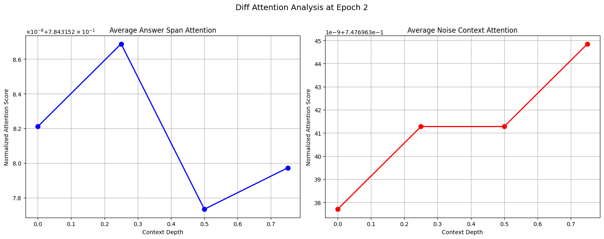
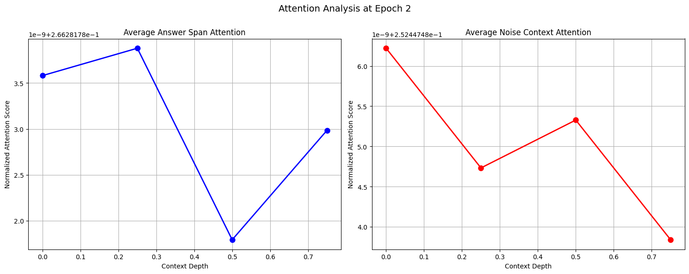

# Attention score analysis: Traditional Decoder and Differential Decoder

This repository contains Python code to train and compare two transformer models:
1. **Traditional Decoder-Only Transformer**
2. **Differential Decoder Transformer (DIFF Transformer)**

Both models are designed to allocate attention scores for key information retrieval tasks. The primary focus of the analysis is comparing the **answer-to-noise ratio** in the attention output for different positions of target information (referred to as "needles") within the context.

## Overview

The **Traditional Decoder-Only Transformer** and **Differential Decoder Transformer** models are compared based on their ability to focus on relevant information (answer spans) and suppress irrelevant context (noise). The models are evaluated by analyzing attention scores across different contexts, where a needle (target phrase) is inserted at varying positions (depths of 0%, 25%, 50%, 75%) within the context and question is asked abou the target phrase.

### Key Features:
- **Traditional Transformer**: Standard transformer architecture with attention allocation across context.
- **Differential Transformer**: Enhanced attention mechanism that allocates higher attention to answer spans and suppresses attention to noise context.

The model setup code initializes the models and defines layers for attention, feedforward networks, and output heads. The models are trained on the **wikitext** dataset.

## Installation and running

To run this code, you need Python 3.x and the following dependencies:

```bash
cd answer-noise-ratio
pip install torch datasets transformers matplotlib tqdm numpy

# for running the differntial attention decoder transformer
python decoder_differential_attention.py

# for running the standard decoder transformer
python decoder_standard_attention.py
```


## Model training and validation

The training process is handled by the train_model function, which includes:

- Loading and tokenizing the dataset.
- Splitting the dataset into training and validation sets.
- Training the models using the AdamW optimizer and cross-entropy loss.
- plotting the normalized attention maps
- Saving the best model based on validation loss.

## Dataset Details:
Dataset: wikitext dataset from Hugging Face.
Context Length: 512 tokens (set as the maximum sequence length).
Batch Size: 32 (can be modified).

## Results Analysis
The key analysis focuses on comparing the attention scores for answer spans and noise spans in the contexts at varying depths (0%, 25%, 50%, and 75%). The attention scores for the final head are normalized and plotted to evaluate the model's focus on relevant information versus noise.

### The analysis compares:

**Answer Span Attention** : Attention given to the target needle (relevant information).
**Noise Context Attention**: Attention given to the surrounding context (irrelevant information).

## Plots:
The x-axis of the plots represents the depths (positions of the target needle within the context), while the y-axis represents the normalized attention values. In the graphs, blue represents the attention allocated to the answer span, while red represents the attention allocated to the noise context.

Figure 1: Attention scores for the Differential Transformer.

Figure 2: Attention scores for the Traditional Transformer.




The graphs above show the attention scores for both the traditional Decoder-Only Transformer and the Differential Decoder Transformer. Upon visual inspection, both models seem to allocate attention similarly across the depths. However, the key difference lies in the range of attention values:

**DIFF Transformer**: The attention allocated to the answer spans is significantly higher, with the noise context receiving attention scores that are approximately 10 times lower than the attention allocated to the answer spans.

**Traditional Transformer**: Both the answer span and noise context receive attention scores within a similar range, between 10^-9 and 10^-8. This indicates that the model is not as effective at differentiating between useful information (answer spans) and noise.

## Conclusion
As seen in the graphs, the answer-to-noise ratio is significantly higher for the Differential Transformer. This suggests that the DIFF Transformer is better at focusing on the relevant information (answer spans) and suppressing irrelevant noise context.


